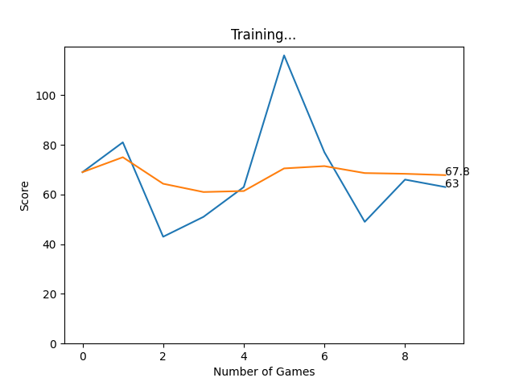
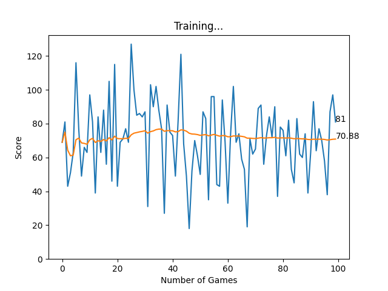
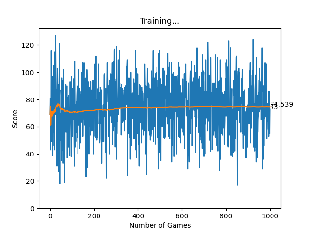
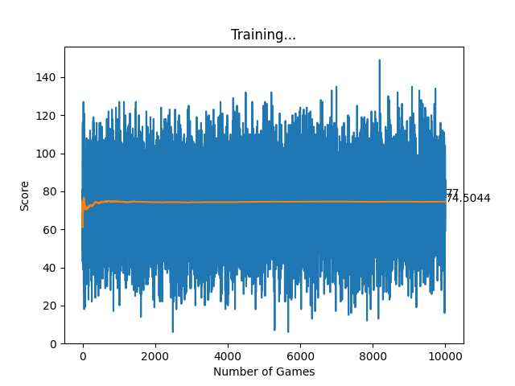
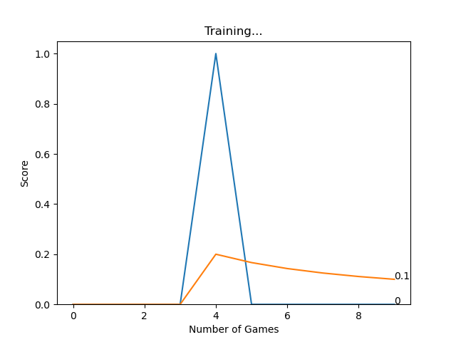
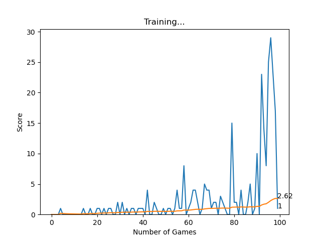
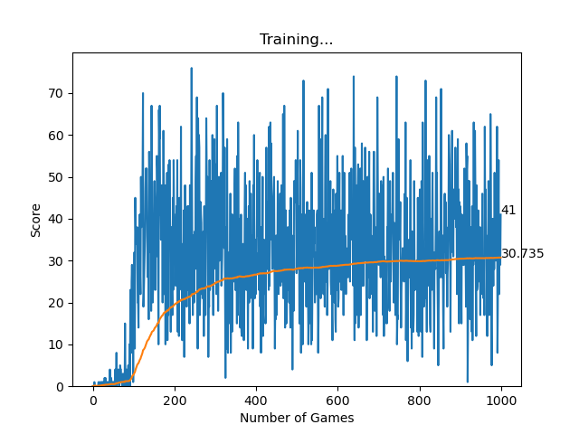
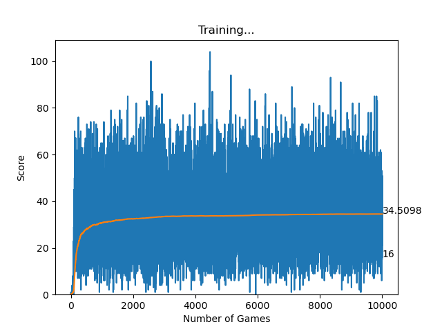

# Our Results

PDF version of our results can be found [here](Results.pdf).

## A-Star Algorithm
- [A-Star Algorithm run 10 times](A_Star_10iterations.png)
- [A-Star Algorithm run 100 times](A_Star_100iterations.png)
- [A-Star Algorithm run 1,000 times](A_Star_1000iterations.png)
- [A-Star Algorithm run 10,000 times](A_Star_10000iterations.png)

| Iterations | Average Score | Graph |
| :---: | :---: | :---: |
| 10 | 67.8 |  |
| 100 | 70.88 |  |
| 1,000 | 74.539 |  |
| 10,000 | 74.5044 |  |

## Deep-Q Neural Network 
- [Deep-Q Neural Network run 10 times](DQN_10iterations.png)
- [Deep-Q Neural Network run 100 times](DQN_100iterations.png)
- [Deep-Q Neural Network run 1,000 times](DQN_1000iterations.png)
- [Deep-Q Neural Network run 10,000 times](DQN_10000iterations.png)

| Iterations | Average Score | Graph |
| :---: | :---: | :---: |
| 10 | 0.1 |  |
| 100 | 2.62 |  |
| 1,000 | 30.735 |  |
| 10,000 | 34.5098 |  |

